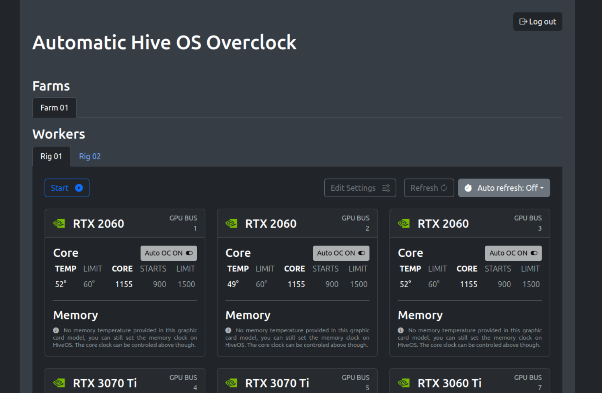

<h1 align="center">Automatic Hive OS Overclock</h1>

 

<!--img src="" alt="ALT"  /-->

    :white_check_mark: Clean Architecture
    :white_check_mark: SOLID
    :white_check_mark: Domain Driven Design
    :white_check_mark: Hexagonal Architecture (Ports and Adapters)
    :white_check_mark: Test Patterns
     
    :white_check_mark: Cloud
    :white_check_mark: Availability and Scalability
    :white_check_mark: Microservice
    :white_check_mark: Messaging
    :white_check_mark: Containerization
    :white_check_mark: NoSQL

    Control overclocks and temperatures due to improve financial gains on mining using Hive OS.

    <a href="http://autohiveoc.com/" target="_blank">autohiveoc.com</a>

## Beta limitations

:triangular_flag_on_post: Only NVIDIA gpus.

:triangular_flag_on_post: Only absolute overclocks greater than 500.

:triangular_flag_on_post: Memory monitoring only when temperature is provided by Hive OS.

:triangular_flag_on_post: Hive OS had blocked API acess to free farm accounts.

## Environment

Of course we encourage you to run this project on localhost first, anyway it was completely deployed and tested on Google Cloud platform using a Kubernetes cluster and a PubSub queue service. You can configure your own cluster on Google Cloud using Terraform, the config files can be found on ~/resources/google-cloud path. MongoDB Atlas cloud database can be configured manually.

On ~/resources path you can also find an Insomnia import file with some endpoints to turn your tests easier. 

You can find more instructions to how setup all the project on each README file into each project module path.

You can also use our own distribution available on <a href="http://autohiveoc.com/" target="_blank">autohiveoc.com</a>.

## Dashboard web

This module is the web front-end (see the printscreen below). Through this web interface panel you are able to connect with Hive OS gpus and set theirs overclock and temperature params, then click on start button and the application will monitoring and tuning the mining by your settings. See the README file into ~/dashboard-web path.

## Dashboard api

This module is the backend rest api connected with web front-end that provide access to Hive OS api and other resources to configurate the monitoring system. See the README file into ~/dashboard-web path.

## Monitoring api

This module is the controller of queue algoritms that manage your gpus on Hive OS fine tunning overclocks and temperatures due to your settings previously provided. See the README file into ~/dashboard-api path.

## Contact

support@autohiveoc.com

gl-lessa@hotmail.com

https://www.linkedin.com/in/lessaguilherme/

